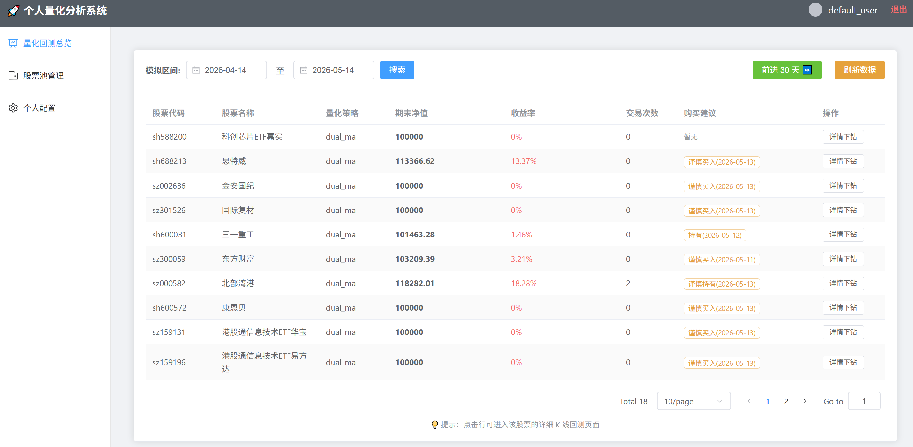
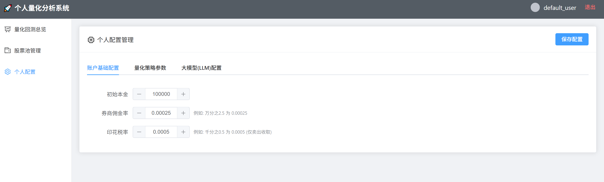
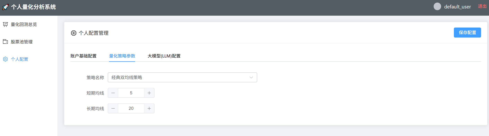
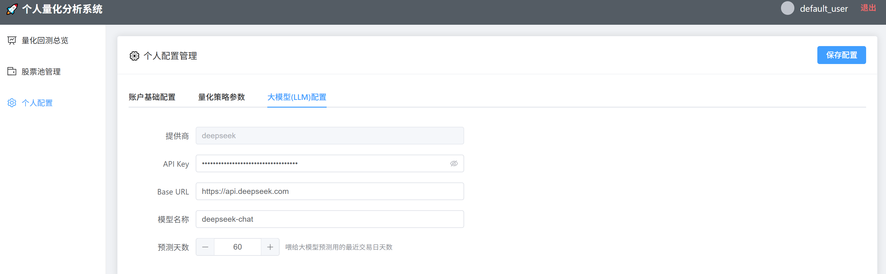
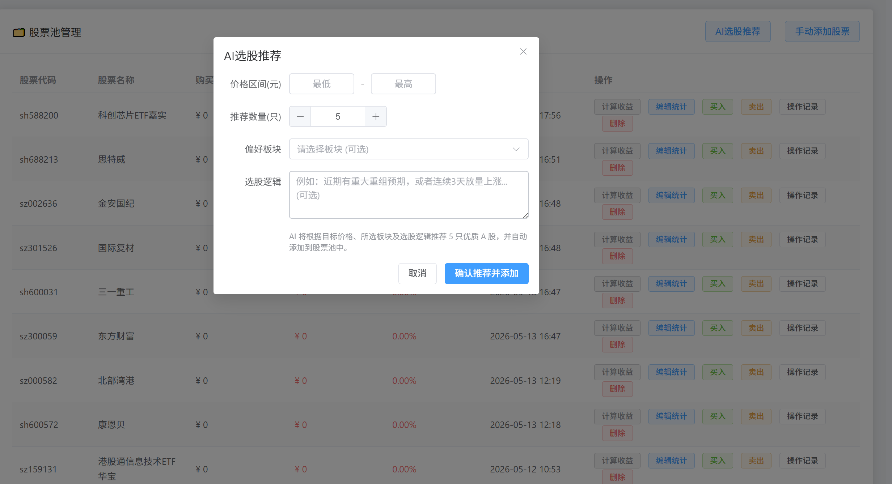
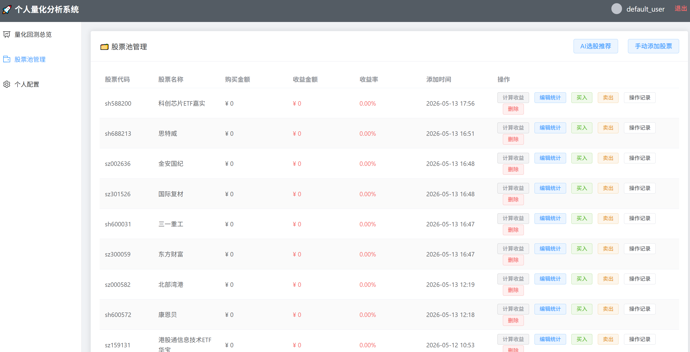
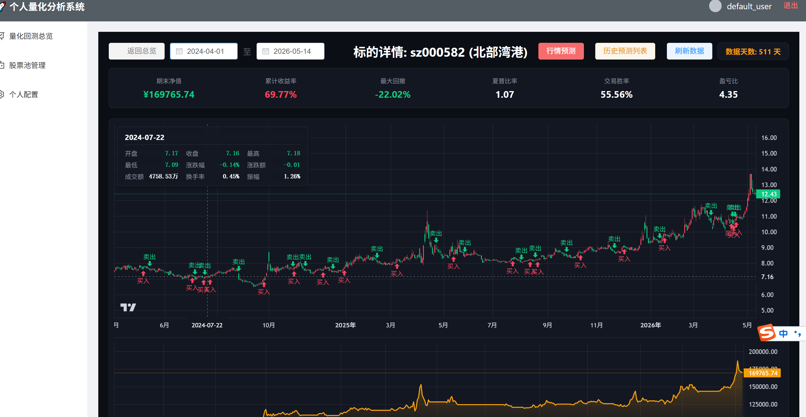
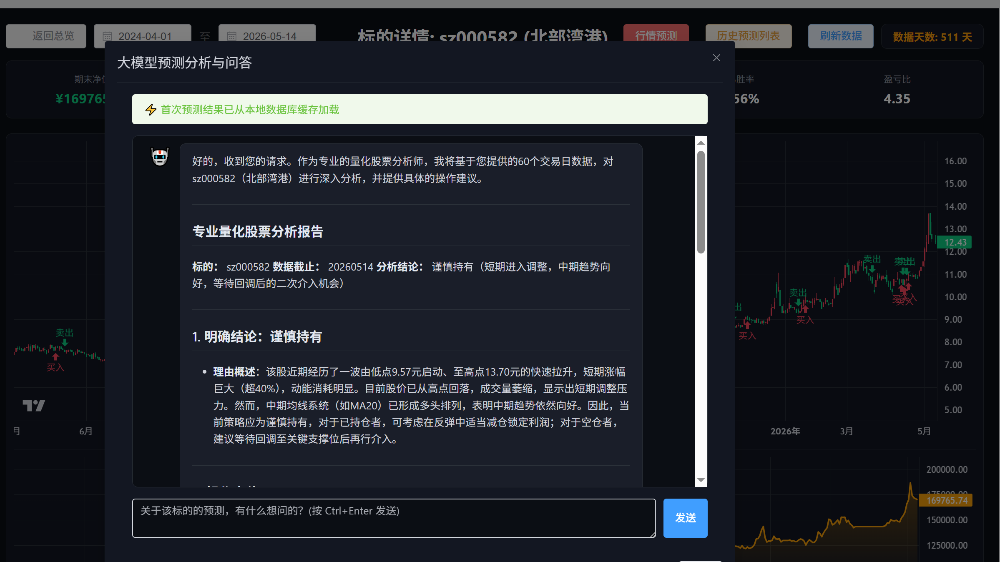
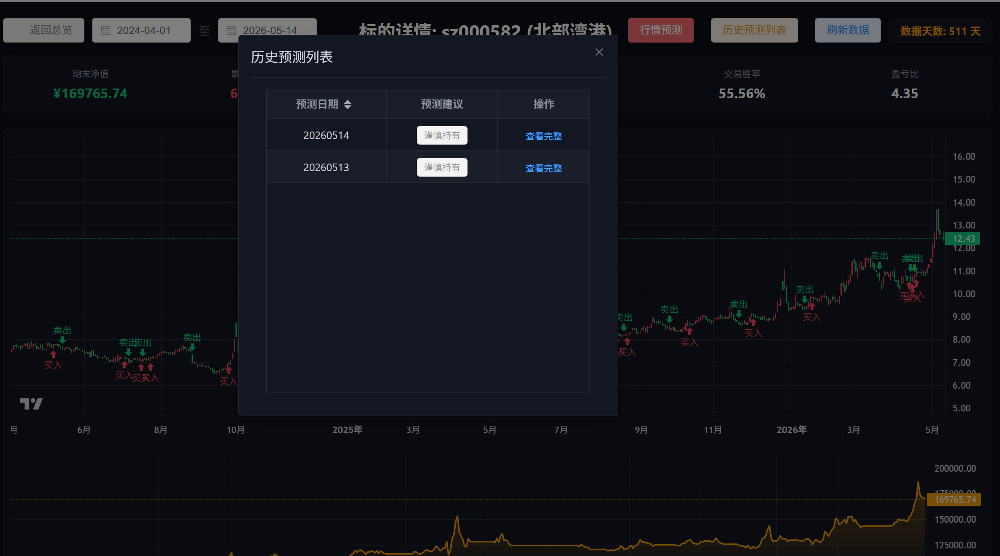

# Quant Simulate System (A 股量化回测与时空推演沙盘)

本项目是一个面向 A 股市场的全栈量化回测与模拟交易终端。它不仅提供了传统量化框架的静态回测功能，还创造性地引入了“步进式时空推演引擎”，允许用户以动态的视角观察策略在牛熊转换中的真实表现。

系统采用前后端分离架构，注重界面的专业性、底层数据的健壮性（防爬虫本地宽泛缓存）以及多维度的智能分析（大语言模型深度接入）。



## 🌟 核心特性 (全新升级)

- **步进式时空推演引擎**：告别“一键看大结局”的回测模式。在单票详情页中，用户可通过每次推进 30 天的方式，动态释放 K 线与买卖点，真实复盘交易决策。
- **AI 大模型深度分析与智能推荐**：
  - **单票推演**：接入 DeepSeek 大语言模型，结合最新的 K 线走势与技术指标，提供智能的行情推演与买卖点预测。
  - **混合智能选股**：融合 AkShare 实时数据预筛（PE < 30、高流动性）与 DeepSeek 深度分析（ROE、行业地位），实现高质量的 AI 个股推荐。
- **全新数据库与多用户体系 (MySQL)**：
  - 彻底重构了底层数据架构，引入多用户体系。支持普通用户与管理员独立登录分离。
  - 用户配置、策略参数、股票池、真实模拟交易流水（买卖点、仓位、成本）全部迁移至 MySQL 数据库，实现千人千面。
- **资产收益自动核算**：
  - 基于真实的 `BUY`/`SELL` 操作流水，系统自动同步持仓成本。
  - 前端一键“计算收益”，结合 AkShare 实时行情或历史数据，自动核算持仓收益额与盈亏比例。
- **全品类资产支持**：突破单一 A 股限制，现已全面支持 ETF 基金（如 563790）及场外公募基金（如 025209）的添加与回测。
- **机构级暗黑终端与独立视图**：
  - 全新侧边栏布局：分离为 `量化回测总览`、`股票池管理` 与 `个人配置`，模块更加清晰。
  - 基于 Vue 3 与 Lightweight-Charts 深度定制，实现 K 线主图与资金曲线副图的时空同步联动缩放。
- **高性能与防爬虫机制**：
  - **双层缓存机制**：Parquet 二进制高速缓存 K 线数据，MySQL 复合主键持久化缓存 AI 推演结果，避免重复计费与数据封堵。
  - **后端分页计算**：回测总览采用按需分页计算，大幅降低 API 并发请求，提升海量股票池的加载速度。

## 🛠 技术栈

- **后端**：Python 3, FastAPI, Pandas, AKShare, Uvicorn, PyMySQL, SQLAlchemy
- **前端**：Vue 3, Vite, Element-Plus, Lightweight-Charts (v4.2.3), Axios, Vue Router, Pinia
- **AI与数据存储**：DeepSeek API, MySQL 8.0+, Parquet (本地二进制缓存)


## 🚀 环境安装与运行指南

本项目需要您具备基本的 Python、Node.js 以及 **MySQL** 运行环境。

### 一. 数据库准备

1. 安装并启动 MySQL 数据库。
2. 创建一个名为 `stock_market_quantitative` 的数据库：
   ```sql
   CREATE DATABASE stock_market_quantitative DEFAULT CHARACTER SET utf8mb4 COLLATE utf8mb4_unicode_ci;
   ```
3. (可选) 修改项目根目录 `config.yaml` 中的 `database` 配置以匹配您的数据库账密。系统启动时会自动初始化表结构。

### 二. 后端部署与启动

建议使用虚拟环境运行本项目。

1. 克隆项目到本地
   ```bash
   git clone https://github.com/你的用户名/quant_simulate_system.git
   cd quant_simulate_system
   ```

2. 创建并激活虚拟环境 (Windows示例)
   ```bash
   python -m venv venv
   .\venv\Scripts\Activate.ps1
   ```

3. 安装核心依赖
   ```bash
   pip install fastapi uvicorn pandas numpy akshare pyarrow pyyaml requests pymysql sqlalchemy
   ```

4. 启动后端服务
   ```bash
   uvicorn backend.main:app --reload
   ```
   *启动成功后，后端服务将运行在 http://127.0.0.1:8000。*

### 三. 前端部署与启动

请保持后端终端运行，新开一个终端窗口进入前端目录。

1. 进入前端目录
   ```bash
   cd frontend
   ```

2. 安装依赖 (注意图表库锁定了支持 marker 的 4.2.3 稳定版本)
   ```bash
   npm install vue-router pinia axios element-plus dayjs
   npm install lightweight-charts@4.2.3
   ```

3. 启动开发服务器
   ```bash
   npm run dev
   ```
   *启动成功后，打开浏览器访问 http://localhost:5173/ 即可进入系统。*

### 四. 初始账号密码

系统首次启动并完成数据库迁移后，会自动生成以下默认体验账号：

- **普通用户**：账号 `default_user` / 密码 `password123`
- **管理员**：账号 `admin` / 密码 `admin123`

*(注：建议在正式环境部署时修改这些默认密码)*

## ⚙️ 系统配置与交互指引

### 1. 个人配置
- 系统默认提供普通用户与管理员两种独立登录入口。
- 登录后，进入左侧菜单的 **“个人配置”**。在这里您可以可视化地修改：
  - **账户基础配置**：初始本金、券商佣金、印花税。
  
  

  - **量化策略配置**：一键切换双均线、布林带等策略，并动态调整其参数（如均线周期、标准差倍数）。
  
  

  - **大模型配置**：配置 DeepSeek API Key、Base URL 及预测天数。
  
  

- *注：早期版本依赖修改 `config.yaml`，现已全面升级为前端可视化配置，所有配置数据永久保存在 MySQL 数据库中，实现千人千面的独立配置。*

### 2. 股票池管理与资产核算
- 进入左侧 **“股票池管理”** 页面，您可以添加任意 A 股、ETF 或场外基金。支持手动添加和 **AI 选股推荐**。



- **交易记录录入**：点击列表中的“买入”/“卖出”按钮，录入真实买卖流水（价格、数量、日期），系统会自动同步您的“持仓成本”。
- **收益一键核算**：点击列表中的“计算收益”按钮，系统将根据实时行情与您的历史操作流水，自动为您计算当前的盈亏金额及收益率。



### 3. 量化回测总览与步进推演
- **全局回测**：在“量化回测总览”中设定全局回测区间。点击“搜索”后，系统会自动按页拉取数据并展示股票池内标的在该区间的期末净值与收益率。


- **推演交互**：点击某只股票右侧的“详情下钻”，进入暗黑推演终端。图表默认展示部分历史数据作为预热期。点击右上角的 **[前进 30 天 ⏩]**，K 线图上将实时标注买卖点箭头，动态展示策略在不同时间段的表现。



- **AI 智能预测与问答**：在推演详情页，点击顶部“行情预测”，系统会调用大语言模型，结合当前已展示的 K 线走势与技术指标，为您出具专业的量化分析报告与操作建议。您还可以通过对话框针对该标的继续追问。



- **历史预测追溯**：点击“历史预测列表”，可以查看系统在过去不同时间节点给出的预测建议记录。



## ⚠️ 注意事项
- **防爬虫保护**：首次加载历史数据或添加新股票代码时，系统需向 AkShare/EastMoney 发起请求。若请求频率过高可能会触发限制。系统已内置随机休眠、重试与 Parquet 二进制持久化缓存，同一支股票的数据一次下载，后续永久本地秒开。
- **API 超时设置**：执行大范围回测或首次拉取大量数据时，可能需要较长时间。前端已针对此类耗时请求增加了超时时间，若偶遇前端假死或红色失败提示，请耐心等待或查看后端控制台日志（后台通常仍在 200 OK 正常处理中）。

## 📜 免责声明
本项目仅供量化交易系统工程学的学习、研究与交流使用。系统内置的策略（如双均线、布林带等）均为教学演示模型，不构成任何投资建议。真实市场存在不可预测的风险，使用本系统产生的一切交易决策和资金盈亏，由使用者自行承担。
